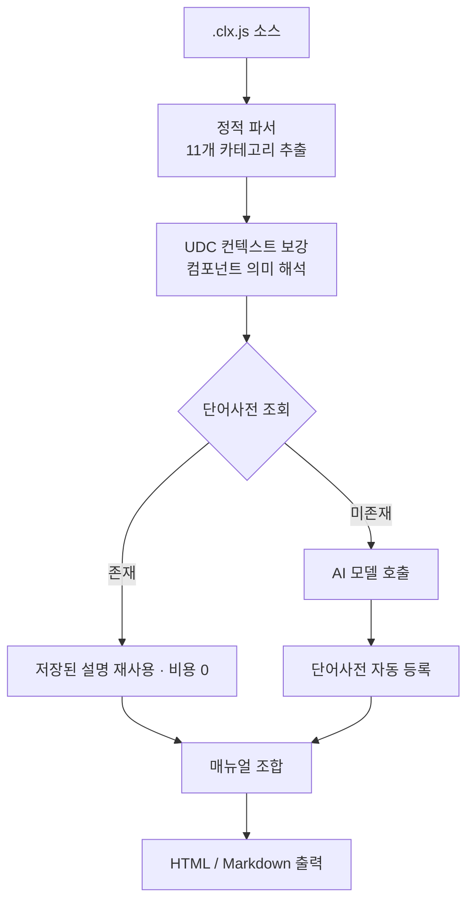
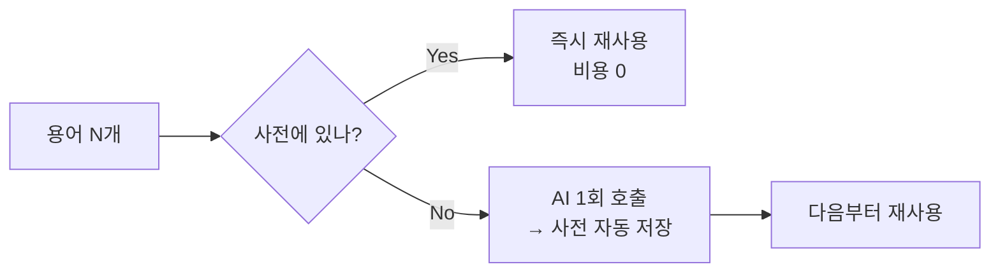
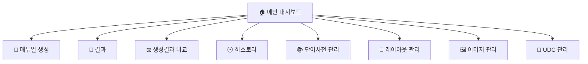

## 슬라이드 1 — 프로젝트 목적 & 문제 정의

### 코드를 매뉴얼로, 수작업을 자동화로

**왜 필요한가 (Why)**

- **반복적인 수작업** — 화면마다 항목·버튼·그리드 설명을 손으로 작성
- **막대한 시간 소모** — 화면 수백 개면 작성·유지보수 공수가 급증
- **일관성 부족** — 작성자마다 용어·설명 스타일이 제각각

**무엇을 제공하나 (What)**

```
.clx.js 업로드 → 정적 분석 + AI 설명 생성 → HTML / Markdown 매뉴얼
```

- exBuilder6 `.clx.js` 화면 소스를 **11개 카테고리**로 정적 분석
- **AI**가 비개발자도 이해할 수 있는 설명·사용법·주의사항 작성
- **단어사전**으로 AI 호출을 줄이고 용어 일관성 보장
- **대상:** exBuilder6로 화면을 개발하는 1인 개발자 / 소규모 팀

| 핵심 가치 | 내용 |
|---|---|
| ⚡ 속도 | 매뉴얼 작성 시간 획기적 단축 |
| 🎯 일관성 | 단어사전 기반 용어·스타일 통일 |
| 💰 비용 절감 | 등록 용어는 AI 미호출, 설명 재사용 |
| 🔁 재현성 | 화면 변경 시 다시 돌리면 매뉴얼 갱신 |

---

## 슬라이드 2 — 워크플로우 & 처리 파이프라인

### 4단계로 끝나는 매뉴얼 생성


**내부 처리 파이프라인 — "구조는 파서가, 설명은 AI가"**



- 파싱은 **결정적** — 같은 입력은 같은 구조 결과 / AI는 **필요한 부분만** 호출
- **11개 분석 카테고리:** 화면개요 · CRUD · 필수값 · 그리드 · 조건그룹 · 인포그룹 · 팝업 · 탭페이지 · 버튼 · 스타일 · 주의사항

---

## 슬라이드 3 — AI 활용 (핵심)

### 3가지 AI 연동 방식 + 비용 최적화 설계

**AI 연동 모드 (환경에 맞게 선택)**

| 모드 | 설명 | 모델 |
|---|---|---|
| **내부 AI 서버 (Gemma)** | 사내 AI 서버 직접 호출 (`http://192.168.71.125/v1`) — 외부 유출 없는 **온프레미스** 운영 | `gemma4-31b` |
| **VS Code 프록시** | VS Code Copilot 프록시(`localhost:3100`) 경유, 별도 키 불필요 | `gpt-4o-mini` 등 |
| **GitHub Models API** | Personal Access Token으로 직접 호출, 독립 실행 | `gpt-4o` / `gpt-4.1-mini` 등 |

> 사내 보안망에서는 **내부 AI 서버 Gemma**로 데이터 외부 전송 없이 매뉴얼 생성이 가능합니다.

**AI가 생성하는 항목**

- 화면 개요 설명 · 사용법(Usage) · 그리드 컬럼 설명 · 조건/컨트롤 설명 · 버튼 설명 · 주의사항(업무 규칙)

**비용 & 품질을 동시에 잡는 설계**



- **단어사전 우선 조회** → 자동 학습 루프(쓸수록 저렴·정확)
- **배치 호출**(최대 15개 단위 분할) + **UDC 컨텍스트 주입**으로 효율·정확도 향상
- **토큰 사용량 추적**으로 비용 가시성 확보

---

## 슬라이드 4 — 전체 기능 & 기술 스택

### 8개 화면으로 완성되는 매뉴얼 자동화



| 기능 | 설명 |
|---|---|
| 📝 **매뉴얼 생성** | 파일 업로드(단일·다중·폴더), 트리 체크박스 선택, AI 설정, 진행률 표시 |
| 📄 **결과** | 11개 카테고리 분석 결과 아코디언, HTML 미리보기(iframe), Markdown, ZIP 다운로드 |
| ⚖️ **생성결과 비교** | VS Code 프록시 vs **내부 AI(Gemma)** 결과를 나란히 비교 + 토큰·통계 비교 |
| 🕑 **히스토리** | DB에 저장된 생성 결과를 디렉토리별로 조회·재확인 |
| 📚 **단어사전 관리** | 용어 CRUD, 카테고리 필터, AI 자동(`ai`)/수동(`manual`) 출처 구분 |
| 🎨 **레이아웃 관리** | 섹션 포함/순서(드래그) 커스터마이징, 프리셋 저장·불러오기 |
| 🖼️ **이미지 관리** | 분석 파일과 동일 이름의 화면 이미지 업로드 → 결과에 자동 적용 |
| 🧩 **UDC 관리** | eXBuilder6 UDC(사용자 정의 컴포넌트) 분석 데이터 관리 |

**기술 스택**

| 영역 | 기술 |
|---|---|
| 프론트엔드 | Next.js 16 (App Router) · React 19 · TypeScript |
| UI / 상태 | TailwindCSS v4 · shadcn/ui · Zustand |
| 백엔드 / DB | Supabase (PostgreSQL) |
| AI | 내부 AI 서버(Gemma) · VS Code Copilot 프록시 · GitHub Models API |
| 유틸 / 배포 | JSZip · Zod · React Hook Form · Vercel |

> **차별점:** 도메인 특화 파서 + 결정적 파싱과 생성형 AI의 하이브리드 + 쓸수록 똑똑해지는 자가 학습 사전 + 온프레미스 AI 지원
